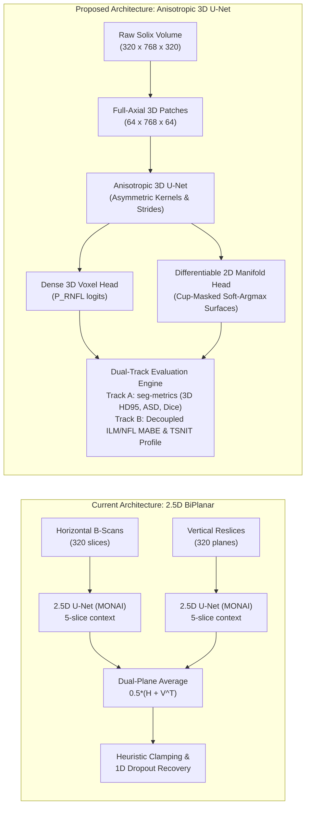
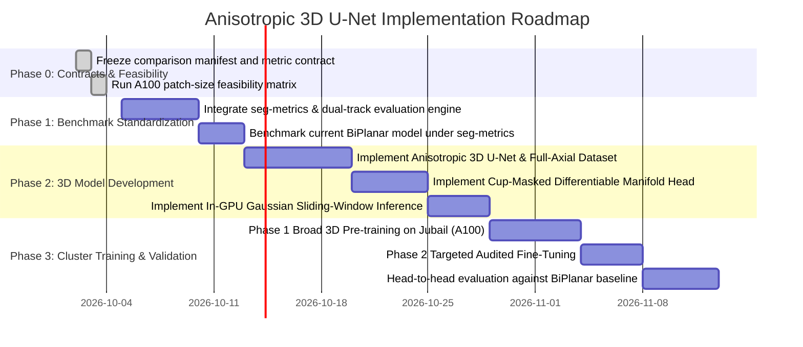

# Implementation Plan: 3D U-Net Architecture Successor to the BiPlanar RNFL Model

---

## 1. Executive Summary

Our current **Volumetric BiPlanar (6.6M) Model** achieves a median held-out validation MABE of **$5.12\,\mu\text{m}$** and a median Dice of **$0.948$**. However, its pseudo-3D formulation (2D multi-slice U-Net with heuristic dual-plane averaging across orthogonal horizontal B-scans and vertical reslices) introduces fundamental bottlenecks:
1. **Inference Latency & Redundancy**: 640 forward passes per volume ($320$ B-scans $+ 320$ vertical resliced planes).
2. **Anisotropic Geometric Mismatch**: Dual-plane fusion forces a 2D network to process planes with fundamentally different physical aspect ratios ($18.81\,\mu\text{m} \times 3.12\,\mu\text{m}$ vs. $18.75\,\mu\text{m} \times 3.12\,\mu\text{m}$) and distinct speckle noise distributions without native 3D spatial awareness.
3. **Averaging Blurs Disagreements**: Simple linear probability blending ($0.5 \times [H + V^\top]$) softens layer transitions where planes disagree, requiring secondary post-processing heuristics (clamping, dropout recovery).

By transitioning to a **Full Anisotropic 3D U-Net**—incorporating self-configuring architectural principles from [nnU-Net (Isensee et al., *Nature Methods* 2021)](https://github.com/mic-dkfz/nnunet), the foundational 3D volumetric learning paradigms of [Çiçek et al. (MICCAI 2016)](https://arxiv.org/abs/1606.06650), and standardized boundary evaluation from [Metrics Reloaded (Reinke et al., 2024)](https://metrics-reloaded.dkfz.de/metric-library/xhd)—we can model the true circumpapillary 3D manifold natively while eliminating dual-plane artifacts. Any speedup claim will be based on measured end-to-end latency rather than forward-pass count.



---

## 2. Retrospective: Limitations of the 2.5D BiPlanar Architecture

The current `VolumetricRNFLNet` processes a 5-slice slab $(z-2, \dots, z+2)$ through a 2D U-Net backbone. To capture cross-slice coherence, `batch_cohort_evaluator.py` implements orthogonal biplanar inference:

$$\mathbf{P}_{\text{fused}}(z, y, x) = \frac{1}{2} \left[ \mathbf{P}_{\text{horiz}}(z, y, x) + \mathbf{P}_{\text{vert}}(x, y, z) \right]$$

### Primary Deficiencies
* **Lack of True 3D Feature Convolutions**: A 2.5D network aggregates context slices only at the input layer. Deep spatial hierarchies cannot propagate spatial gradients diagonally or spherically across the optic disc cup margin.
* **Aspect Ratio Distortions**: Transverse reslicing along the slow axis ($Z$) introduces interpolation discontinuities because B-scan acquisition speeds and eye-motion artifacts (micro-saccades) differ dramatically between in-frame A-scans and inter-frame B-scans.
* **Disagreement Blurring**: When horizontal and vertical passes disagree on the boundary (e.g. near steep cup slopes or shadow regions), averaging lowers peak probabilities below the activation threshold ($\tau = 0.40$), inadvertently inducing boundary dropouts that require manual curve-guided heuristics to patch.
* **Redundant Forward-Pass Overhead**: Executing 640 full 2D forward passes per 3D volume severely slows down clinical deployment and high-throughput cohort validation runs.

---

## 3. The 3D U-Net & nnU-Net Blueprint for OCT Volumes

In Çiçek et al. (MICCAI 2016), the standard 2D U-Net was extended to dense 3D volumes by replacing all 2D operations (convolutions, batch normalization, max-pooling, up-convolutions) with their 3D counterparts. nnU-Net (Isensee et al., 2021) established key design rules for applying 3D U-Nets to anisotropic medical volumes:

### 3.1 Handling Extreme Voxel Anisotropy with Asymmetric Strides and En-Face Symmetric Kernels
In our Optovue Solix OCT `Disc Cube`, the physical voxel spacing is:

$$\mathbf{s} = [s_z, s_y, s_x] = [18.81\,\mu\text{m}, \; 3.12\,\mu\text{m}, \; 18.75\,\mu\text{m}]$$

The axial dimension ($Y$, depth, dimension 1) has **$6.0\times$ higher resolution** than the transverse en-face axes ($Z$ and $X$, dimensions 0 and 2). 

> [!IMPORTANT]
> **Avoiding the "nnU-Net CT vs. OCT" Inversion Trap**:
> In standard medical CT/MRI, the through-plane slice axis $Z$ (dimension 0) has coarse resolution (e.g. $5.0\,\text{mm}$), while in-plane axes $(Y, X)$ have fine resolution ($0.7\,\text{mm}$). Consequently, canonical nnU-Net recipes use $(1, 3, 3)$ kernels and $(1, 2, 2)$ strides.
> In **retinal OCT Disc Cubes**, the resolution profile is fundamentally different:
> - Axial depth $Y$ (dimension 1) is the ultra-high resolution axis ($3.12\,\mu\text{m}$).
> - En-face axes $Z$ and $X$ (dimensions 0 and 2) are **physically isotropic with each other** ($18.81\,\mu\text{m} \approx 18.75\,\mu\text{m}$).
> Blindly adopting $(1, 3, 3)$ kernels would freeze receptive field expansion along the $Z$ slow axis while convolving along $X$, arbitrarily breaking en-face physical symmetry.

**Corrected OCT Anisotropic Adaptation Strategy**:
1. **Asymmetric Axial Strides (Stages 1 & 2)**: Use anisotropic downsampling strides $(1, 2, 1)$ so that pooling occurs exclusively along the high-resolution axial axis ($Y$) from $768 \to 384 \to 192$, preserving en-face spatial resolution until axial feature spacing approaches near-isotropy with transverse spacing ($\approx 18.8\,\mu\text{m} \times 12.5\,\mu\text{m} \times 18.8\,\mu\text{m}$).
2. **En-Face Symmetric 3D Kernels**: Maintain isotropic transverse kernels $(3, 3, 3)$—or axial-emphasized $(3, 5, 3)$—at all stages to guarantee equal spatial gradient propagation along both $Z$ and $X$.
3. **Transition to Isotropic Pooling (Stage 3 & Bottleneck)**: Once axial feature spacing reaches $\approx 12.5\,\mu\text{m}$, switch to standard isotropic downsampling strides $(2, 2, 2)$.

| Stage | Input Resolution $(D \times H \times W)$ | Downsampling Stride $(z, y, x)$ | Effective Spacing $(\mu\text{m}) \; [z, y, x]$ | Conv3D Kernel $(z, y, x)$ | Feature Channels |
| :--- | :--- | :--- | :--- | :--- | :--- |
| **Stage 1** | $64 \times 768 \times 64$ | $(1, 2, 1)$ | $18.81 \times 3.12 \times 18.75$ | $(3, 3, 3)$ | 32 |
| **Stage 2** | $64 \times 384 \times 64$ | $(1, 2, 1)$ | $18.81 \times 6.24 \times 18.75$ | $(3, 3, 3)$ | 64 |
| **Stage 3** | $64 \times 192 \times 64$ | $(2, 2, 2)$ | $18.81 \times 12.48 \times 18.75$ *(near-isotropic)* | $(3, 3, 3)$ | 128 |
| **Stage 4** | $32 \times 96 \times 32$ | $(2, 2, 2)$ | $37.62 \times 24.96 \times 37.50$ | $(3, 3, 3)$ | 256 |
| **Bottleneck**| $16 \times 48 \times 16$ | — | $75.24 \times 49.92 \times 75.00$ | $(3, 3, 3)$ | 384 |

---

### 3.2 Full-Axial Sub-Volume Formulation & GPU-Accelerated Sliding Window

A full volume of $320 \times 768 \times 320$ in `float32` requires $\approx 315\,\text{MB}$ for raw voxels and $>25\,\text{GB}$ in activations during backpropagation.

#### A. Full Axial Depth ($H=768$) as the Reference Design
In retinal OCT, retinal layers are anatomically stacked along the axial column ($Y$). Randomly cropping along $Y$ (e.g. $H=384$) introduces fatal boundary truncation:
* If a patch clips the upper vitreous boundary or deeper choroidal layer, axial Soft-Argmax produces arbitrary local predictions collapsed onto patch boundaries $[0, 383]$, corrupting global surface regression against ground truth $y_{\text{GT}} \in [0, 767]$.
* The initial reference design constrains the sub-volume to **full axial depth** $(D \times H \times W) = (64 \times 768 \times 64)$ or $(48 \times 768 \times 96)$, so every sub-volume contains the complete anatomical retinal column from vitreous through choroid. An anatomy-preserving axial ROI with an explicit global-coordinate offset remains a valid fallback if the A100 feasibility gate shows inadequate memory headroom.

#### B. GPU-Accelerated Sliding-Window Inference
During inference, transverse sliding-window extraction runs with $50\%$ overlap along $Z$ and $X$:
1. A 2D/3D separable Gaussian importance weighting window $\mathbf{W}_{\text{gauss}}(z, x) = \exp\left(-\frac{(z - \mu_z)^2}{2\sigma_z^2} - \frac{(x - \mu_x)^2}{2\sigma_x^2}\right)$ scales predicted patch probabilities, suppressing border stitching artifacts.
2. Accumulation runs directly in PyTorch GPU memory (`torch.cuda.amp.autocast(dtype=torch.bfloat16)`) to avoid host-device CPU-GPU transfer bottlenecks that would otherwise drop GPU utilization below NYUAD Jubail's $5\%$ daemon kill threshold:

$$\hat{\mathbf{P}}_{\text{vol}}(z, y, x) = \frac{\sum_{k} \mathbf{W}_{k}(z, x) \odot \hat{\mathbf{P}}_{k}(z, y, x)}{\sum_{k} \mathbf{W}_{k}(z, x)}$$

---

## 4. Architectural Blueprint: 3D Volumetric-to-Manifold Network

Unlike parenchymal organs, the retinal nerve fiber layer (RNFL) is anatomically a **continuous 2D sheet** bounded by the Inner Limiting Membrane (ILM) above and the Ganglion Cell Layer (GCL/NFL) below, with an anatomical gap over the optic nerve cup.

The 3D U-Net successor combines **dense volumetric voxel segmentation** with a **differentiable 2D surface regression manifold**.

```
                         3D Anisotropic U-Net Backbone
                        ┌───────────────────────────────┐
Raw 3D Patch ────────► │ 3D Encoder (ResBlocks + Stride)│
(B, 1, 64, 768, 64)    │               ▼               │
                        │ 3D Bottleneck (16 x 48 x 16)  │
                        │               ▼               │
                        │ 3D Decoder (Trilinear + Skip) │
                        └──────────────┬────────────────┘
                                       │
                ┌───────────────────────┴────────────────────────┐
                ▼                                                ▼
       [Head 1: Dense 3D Logits]                   [Head 2: 2D En-Face Cup Head]
       Conv3D(32, 1, kernel_size=1)                Axial Pool(H=1) + Conv2D Block
                │                                                │
                ▼                                                ▼
      P_mask: (B, 1, 64, 768, 64)                  c_hat(z, x): (B, 1, 64, 64)
      Dense 3D RNFL Probabilities                  2D Optic Cup Probability Map
                │
                ▼ (Differentiable Functional Layer)
       [Parameter-Free Axial Soft-Argmax]
       y_hat_ILM(z, x), y_hat_NFL(z, x): (B, 64, 64)
       Continuous Retinal Layer Heightmaps
```

### 4.1 Laterality Canonicalization
Following workspace standards, all scans are standardized to canonical right-eye (OD) geometry prior to 3D patch extraction (`--os_orientation_mode corrected`). Left-eye (OS) volumes are flipped horizontally along $X$ so the network trains exclusively on a uniform temporal-superior-nasal-inferior-temporal (TSNIT) coordinate frame. The native orientation is restored post-inference for clinical reporting.

### 4.2 Decoupled Multi-Task Heads & Differentiable Surface Extraction

#### Head 1: Dense 3D Voxel Head
Projects decoder features via `Conv3D(32, 1, kernel_size=1)` to output dense 3D logits $\mathbf{Z}(z, y, x)$, producing voxel probability volume $\mathbf{P}(z, y, x) = \sigma(\mathbf{Z}(z, y, x))$.

#### Head 2: 2D En-Face Optic Cup Classifier Head
Unlike the dense voxel mask, optic cup presence is a topological 2D en-face phenomenon. Decoder features are axially pooled across depth $H$:
$$\mathbf{F}_{\text{enface}}(z, x) = \frac{1}{H} \sum_{y=0}^{H-1} \mathbf{F}_{\text{decoder}}(z, y, x)$$
A lightweight 2D convolutional block (`Conv2D(32, 16, 3, pad=1)` $\to$ `ReLU` $\to$ `Conv2D(16, 1, 1)`) predicts optic cup presence probability $\hat{c}(z, x) \in [0, 1]$.

#### Differentiable Surface Extraction Layer with Cup-Singularity Masking
Surface heightmaps $\hat{y}_{\text{ILM}}(z, x)$ and $\hat{y}_{\text{NFL}}(z, x)$ are extracted differentiably across the full axial depth ($H=768$) from the 3D predicted probability volume $\mathbf{P}(z, y, x) \in [0, 1]$:

$$\hat{y}_{\text{ILM}}(z, x) = \sum_{y=0}^{H-1} y \cdot \text{softmax}_{y}\left(\frac{\nabla_y \mathbf{P}(z, y, x)}{\tau}\right)$$

$$\hat{y}_{\text{NFL}}(z, x) = \sum_{y=0}^{H-1} y \cdot \text{softmax}_{y}\left(\frac{-\nabla_y \mathbf{P}(z, y, x)}{\tau}\right)$$

where $\nabla_y$ is the axial central-difference gradient operator ($\nabla_y \mathbf{P}_{y} = \mathbf{P}_{y+1} - \mathbf{P}_{y-1}$) and $\tau = 0.1$ is the sharpening temperature parameter.

#### Eliminating the Cup Singularity (Training & Inference Contracts)
1. **Training Time**: Inside the optic cup cavity, RNFL thickness is zero and $\mathbf{P}(z, y, x) \approx 0 \implies \nabla_y \mathbf{P} \approx \mathbf{0}$. An unmasked Soft-Argmax produces a flat uniform distribution that collapses to the vertical midpoint ($y \approx H/2 = 384$). The continuous surface loss $\mathcal{L}_{\text{Huber}}$ is **explicitly masked by the ground truth cup complement $(1 - c_{\text{GT}})$**:

$$\mathcal{L}_{\text{Huber}}^{\text{masked}} = \frac{\sum_{z, x} (1 - c_{\text{GT}}(z, x)) \left[ \text{Huber}(\hat{y}_{\text{ILM}} - y_{\text{ILM}}^{\text{GT}}) + \text{Huber}(\hat{y}_{\text{NFL}} - y_{\text{NFL}}^{\text{GT}}) \right]}{\sum_{z, x} (1 - c_{\text{GT}}(z, x)) + \epsilon}$$

2. **Inference Time**: For any column where the predicted cup confidence $\hat{c}(z, x) \ge 0.5$ (or total column probability $\sum_y \mathbf{P}(z, y, x) < 3.0$), the RNFL thickness is physically clamped to zero ($\hat{y}_{\text{NFL}}(z, x) = \hat{y}_{\text{ILM}}(z, x)$), completely suppressing the midpoint artifact in downstream clinical reports.

### 4.3 Multi-Task 3D Compound Objective
$$\mathcal{L}_{\text{total}} = \mathcal{L}_{\text{Dice-CE}}^{\text{3D}} + \lambda_{\text{surf}} \mathcal{L}_{\text{Huber}}^{\text{masked}} + \lambda_{\text{edge}} \mathcal{L}_{\text{Sobel3D}} + \lambda_{\text{cup}} \mathcal{L}_{\text{BCE}}(\hat{c}, c_{\text{GT}})$$

* $\mathcal{L}_{\text{Dice-CE}}^{\text{3D}}$: nnU-Net combination of Soft Dice Loss and Weighted BCE over the 3D voxel volume ($\lambda=1.0$).
* $\mathcal{L}_{\text{Huber}}^{\text{masked}}$: Cup-masked Smooth L1 loss on ILM and NFL surface depths in physical $\mu\text{m}$ ($\lambda_{\text{surf}}=0.5$).
* $\mathcal{L}_{\text{Sobel3D}}$: Optical gradient alignment loss sampling axial intensity gradients $|\nabla_y I_{\text{OCT}}|$ along predicted surface $\hat{y}_{\text{NFL}}$ via 3D grid sampling ($\lambda_{\text{edge}}=0.1$):

$$\mathcal{L}_{\text{Sobel3D}} = - \frac{\sum_{z, x} (1 - c_{\text{GT}}(z, x)) \cdot \mathcal{G}_{\text{interp}}\left(|\nabla_y I_{\text{OCT}}|, \; [z, \hat{y}_{\text{NFL}}(z, x), x]\right)}{\sum_{z, x} (1 - c_{\text{GT}}(z, x)) + \epsilon}$$

* $\mathcal{L}_{\text{cup}}$: Binary cross-entropy on optic cup presence across the $Z \times X$ en-face grid from Head 2 ($\lambda_{\text{cup}}=0.2$).

---

## 5. Standardized Evaluation & Mitigating Benchmarking Bias

### 5.1 Analysis of PMC4533825 (Taha & Hanbury, 2015)
The benchmark paper *"Metrics for evaluating 3D medical image segmentation"* established that:
- **Dice is Insensitive to Boundary Creep**: For thin layer-like structures (such as the RNFL, which is only $10\text{--}40$ voxels thick axially), large spatial boundary shifts in localized regions produce negligible changes in volumetric Dice.
- **Distance Metrics Expose Local Ruptures**: Distance metrics (Hausdorff, Average Surface Distance) are essential to catch clinically unacceptable layer penetrations (e.g. GCL hyporeflective wedge diving).

### 5.2 Metrics Reloaded: The $x^{\text{th}}$ Percentile Hausdorff Distance ($XHD$)
As formalized by [Metrics Reloaded (Reinke et al., 2024)](https://metrics-reloaded.dkfz.de/metric-library/xhd):
- Maximum Hausdorff Distance ($\text{HD}_{\max}$) is hypersensitive to a single stray voxel outlier (e.g. speckle noise artifact).
- The **$x^{\text{th}}$ Percentile Hausdorff Distance ($XHD$, typically $\text{HD}_{95}$)** computes the 95th percentile of shortest surface-to-surface distances between the predicted boundary $\mathcal{S}_{\text{pred}}$ and reference surface $\mathcal{S}_{\text{ref}}$:

$$\text{HD}_{95}(A, B) = \max \left( P_{95} \left( \min_{b \in \mathcal{S}_B} \|a - b\|_{\mathbf{s}} \right), \; P_{95} \left( \min_{a \in \mathcal{S}_A} \|b - a\|_{\mathbf{s}} \right) \right)$$

where $\|\cdot\|_{\mathbf{s}}$ is the anisotropic Euclidean norm scaled by voxel spacing:

$$\|a - b\|_{\mathbf{s}} = \sqrt{s_z^2 (z_a - z_b)^2 + s_y^2 (y_a - y_b)^2 + s_x^2 (x_a - x_b)^2}$$

### 5.3 Standardization via `seg-metrics` and Daemon-Safe Decoupling
Different medical imaging libraries produce divergent metric values for identical segmentation arrays due to connectivity conventions, spacing ingestion, and empty mask handling. To guarantee reproducibility, all volumetric benchmarks will standardize on the [`seg-metrics`](https://github.com/Jingnan-Jia/segmentation_metrics) package with pinned parameters:

> [!WARNING]
> **NYUAD Jubail GPU Daemon Protection & Evaluation Decoupling**:
> Computing 3D surface distance transforms (such as $\text{HD}_{95}$ and ASD) via CPU-based `seg-metrics` on a $320 \times 768 \times 320$ volume ($78.6\times 10^6$ voxels) requires **$30\text{--}60$ seconds of pure CPU computation per volume**.
> If evaluated synchronously across 20 validation volumes inside `train.py` at the end of each epoch, the allocated A100 GPU sits idle at $0\%$ utilization for $>15$ minutes, which risks triggering Jubail's automated daemon kill threshold ($< 5\%$ average GPU utilization).
> 
> Therefore, evaluation is strictly decoupled into two execution pipelines:
> 1. **In-Training Epoch Validation (GPU-Resident)**: Vectorized 3D Soft-Dice, BCE, and cup-masked Huber surface loss executed entirely in bfloat16 on the GPU ($< 90$ seconds total per epoch, maintaining $\ge 90\%$ GPU utilization).
> 2. **Post-Training Cohort Benchmarking (CPU `seg-metrics`)**: Standalone batch evaluation in `batch_cohort_evaluator.py` executed either on CPU partitions or post-training without holding active GPU resources.

```python
import seg_metrics.seg_metrics as sg

# Standardized 3D Volume Metric Extraction
metrics = sg.write_metrics(
    labels=[1],                  # RNFL class
    gdth_img=gt_mask_3d,         # Binary ground truth volume (Z, Y, X)
    pred_img=pred_mask_3d,       # Binary predicted volume (Z, Y, X)
    csv_file=None,
    spacing=[18.81, 3.12, 18.75],# Physical voxel spacing in micrometers: [dz, dy, dx]
    metrics=['dice', 'hd', 'hd95', 'msd']
)
```

The pinned adapter computes bounded volume similarity separately as $1-|V_p-V_g|/(V_p+V_g)$ because `seg-metrics==1.2.8` exposes `vs` as a signed relative volume difference.

### 5.4 Dual-Track Benchmark: Harmonizing 3D `seg-metrics` with Clinical Ophthalmology Standards
In a 3D binary volume, `seg-metrics` extracts the entire exterior surface $\partial M$, conflating anterior ILM, posterior NFL/GCL, and lateral cup margins into a single distance pool. In ophthalmology, clinical diagnosis relies on decoupled layer metrics.

To ensure both rigorous engineering standardization and clinical validity, all future evaluations will enforce a **Dual-Track Evaluation Engine**:

| Evaluation Track | Target Dimension | Primary Metrics | Purpose |
| :--- | :--- | :--- | :--- |
| **Track A: Volumetric Benchmark** | 3D Binary Volume Shell ($\partial M$) | `seg-metrics` $\text{HD}_{95}$ ($\mu\text{m}$), MSD/ASD ($\mu\text{m}$), 3D Dice | Reproducible engineering comparison against medical imaging baselines. |
| **Track B: Clinical Ophthalmology** | Decoupled Retinal Surfaces & TSNIT Sectors | Decoupled ILM MABE ($\mu\text{m}$), NFL MABE ($\mu\text{m}$), $P_{95}$ errors ($\mu\text{m}$), TSNIT sector profile delta | Clinical diagnosis: identifying wedge defects, cup margin tracking, and nerve fiber atrophy. |

---

## 6. Architecture Comparison & Roadmap

| Feature / Dimension | Current Model: 2.5D BiPlanar (6.6M) | Proposed Successor: Anisotropic 3D U-Net |
| :--- | :--- | :--- |
| **Core Backbone** | 2D ResNet / U-Net (MONAI) | Full 3D Anisotropic U-Net (nnU-Net style) |
| **Input Representation** | 5 Context Slices $(z\pm 2)$ | Full-Axial 3D Sub-Volumes $(64 \times 768 \times 64)$ |
| **Volumetric Coherence** | Heuristic averaging of 2 orthogonal planes | End-to-end 3D spatial convolutions across $(Z, Y, X)$ |
| **Forward Passes per Volume** | **640** ($320$ Horiz $+ 320$ Vert) | **81** for a $64\times64$ transverse window with $50\%$ overlap; latency must be benchmarked directly |
| **Convolution Kernels** | Isotropic 2D $(3 \times 3)$ | En-Face Symmetric 3D $(3, 3, 3)$ with anisotropic axial strides $(1,2,1) \to (2,2,2)$ |
| **Boundary Modeling** | 1D A-scan column regression | 2D Manifold Heightmaps $(Z \times X)$ via Full-Column Soft-Argmax |
| **Optic Cup Handling** | 1D absence classifier + elliptical mask | 2D en-face CNN head ($\hat{c}$) + cup-masked Huber loss + zero-thickness inference clamping |
| **Downsampling Logic** | Isotropic 2D strides | Anisotropic strides ($(1,2,1) \to (2,2,2)$) |
| **Evaluation Standard** | Pixel MABE / P95 in pixels | **Dual-Track**: `seg-metrics` $\text{HD}_{95}$ ($\mu\text{m}$) + Decoupled Surface MABE ($\mu\text{m}$) |

### Phased Implementation Roadmap



### HPC Execution Resource Allocation (NYUAD Jubail)
* **Hardware & SLURM Directives**: Single NVIDIA A100 (40GB or 80GB), `#SBATCH -p nvidia --gres=gpu:a100:1 -c 8 --mem=48G`.
* **Micro-Batching & Precision**: Jubail job `18555334` selected mixed bfloat16 precision with micro-batch size $B_{\text{micro}}=1$ and 8-step gradient accumulation. The $64\times768\times64$, batch-size-1 probe reserved 19.49 GiB on an A100 40GB; batch size 2 reserved 38.72 GiB and was rejected for insufficient headroom.
* **GPU Daemon Protection**: Pre-cache volumes into memory (`pin_memory=True`), perform sliding-window Gaussian accumulation directly on GPU tensors, and avoid CPU-bound NumPy loops during in-training validation. Exhaustive CPU `seg-metrics` $\text{HD}_{95}$ calculations are strictly decoupled into post-training `batch_cohort_evaluator.py` runs to guarantee training GPU utilization stays $\ge 85\%$ and well above the $5\%$ kill threshold.
* **Epoch Budget**: 25 epochs broad pre-training + 10 epochs human-audited fine-tuning with Cosine Annealing learning rate schedule ($\eta_{\max} = 3 \times 10^{-4}, \eta_{\min} = 10^{-6}$).

---

## 7. Immediate Next Steps

1. **Implement the Selected Dense Backbone and Loader**: Use the Phase 0 selection of $(64,768,64)$, bfloat16, micro-batch 1, and 8-step gradient accumulation. Keep the first ablation limited to the dense voxel head.
2. **Integrate the Tested Metric Adapter**: Connect `model_training/train_rnfl_3d/evaluation_metrics.py` to `batch_cohort_evaluator.py`, preserving whole-volume metrics separately from decoupled clinical surface metrics.
3. **Benchmark the Frozen Baseline**: Use `manifests/successor_held_out_v1.json` for the primary successor-versus-current-BiPlanar comparison. Use `mutual_held_out_v1.json` only when older checkpoints with narrower validation sets are included.
4. **Prototype the Dense 3D Backbone**: Implement the selected patch configuration and dense voxel head first. Add the NFL-absence and surface heads only through subsequent ablations; mask absent NFL supervision without discarding valid ILM supervision.
