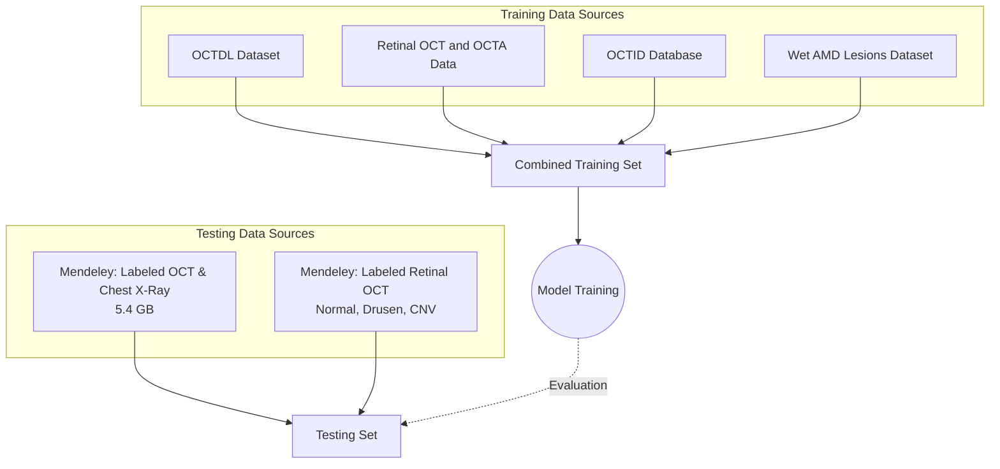

# OCT Image Dataset Documentation

## Overview
The dataset used for training and testing the optical coherence tomography (OCT) image classification model is a curated amalgamation of several open-source retinal imaging databases. To ensure robust model evaluation, the data is partitioned such that datasets sourced from **Mendeley Data** are exclusively reserved for testing, while all other datasets form the comprehensive training set.

## Diagram: Dataset Combination

## Datasets and Citations

### 1. OCTDL: Optical Coherence Tomography Dataset
- **Description:** Contains over 2,000 OCT images labeled for various retinal conditions (AMD, DME, ERM, RAO, RVO, VMID, Normal). Includes metadata CSV detailing patient demographics, eye side, image size, and diagnostic conditions.
- **Source:** Kaggle
- **Link:** [https://www.kaggle.com/datasets/orvile/octdl-optical-coherence-tomography-dataset](https://www.kaggle.com/datasets/orvile/octdl-optical-coherence-tomography-dataset)

### 2. Retinal OCT and OCTA Data (Raw)
- **Description:** Collection of raw Optical Coherence Tomography (OCT) and OCT Angiography (OCTA) data for retinal imaging analysis and exploration.
- **Source:** Kaggle
- **Link:** [https://www.kaggle.com/datasets/cnzakimuena/retinal-oct-octa-data](https://www.kaggle.com/datasets/cnzakimuena/retinal-oct-octa-data)

### 3. Optical Coherence Tomography Image Retinal Database (OCTID)
- **Origin:** Captured using a Cirrus HD-OCT machine at Sankara Nethralaya Eye Hospital in Chennai, India.
- **Contents:** Over 500 high-resolution volumetric and 2D B-scan images.
- **Categories:** Labeled by experienced clinicians into Normal (NO), Macular Hole (MH), Age-related Macular Degeneration (AMD), Central Serous Retinopathy (CSR), and Diabetic Retinopathy (DR).
- **Segmentation:** Includes 25 normal OCT images with manual, ground-truth delineations for evaluating segmentation algorithms.
- **Source:** OpenICPSR (Project 108503)
- **Link:** [https://www.openicpsr.org/openicpsr/project/108503/version/V1/view](https://www.openicpsr.org/openicpsr/project/108503/version/V1/view)

### 4. An OCT Image Dataset for Wet AMD Lesions Segmentation
- **Description:** 1.3 GB dataset focused on Wet Age-Related Macular Degeneration (AMD). Provides original OCT images with corresponding segmented images for lesions, patient info, and grouping data.
- **Source:** Figshare
- **Link:** [https://springernature.figshare.com/articles/dataset/An_Optical_Coherence_Tomography_Image_Dataset_for_wet_AMD_Lesions_Segmentation/25513435](https://springernature.figshare.com/articles/dataset/An_Optical_Coherence_Tomography_Image_Dataset_for_wet_AMD_Lesions_Segmentation/25513435)

---

### 5. Labeled Optical Coherence Tomography (OCT) and Chest X-Ray Images for Classification
- **Description:** 5.4 GB dataset from UC San Diego containing validated OCT images (and Chest X-Rays). OCT data is split into training/testing, labeled into: CNV, DME, DRUSEN, and NORMAL.
- **Source:** Mendeley Data (Daniel Kermany, Kang Zhang, Michael Goldbaum)
- **Citation:** Kermany, Daniel; Zhang, Kang; Goldbaum, Michael (2018), “Labeled Optical Coherence Tomography (OCT) and Chest X-Ray Images for Classification”, Mendeley Data, V2, doi: 10.17632/rscbjbr9sj.2
- **Link:** [https://data.mendeley.com/datasets/rscbjbr9sj/2](https://data.mendeley.com/datasets/rscbjbr9sj/2)
- **Note:** Utilized exclusively for model testing.

### 6. Labeled Retinal OCT Dataset (Normal, Drusen, CNV)
- **Description:** Over 16,000 retinal OCT B-scans from 441 cases, categorized into Normal (120), Drusen (160), and CNV (161). Includes patient metadata and a Python script for NumPy array loading.
- **Source:** Mendeley Data
- **Link:** [https://data.mendeley.com/datasets/8kt969dhx6/2](https://data.mendeley.com/datasets/8kt969dhx6/2)
- **Note:** Utilized exclusively for model testing.
