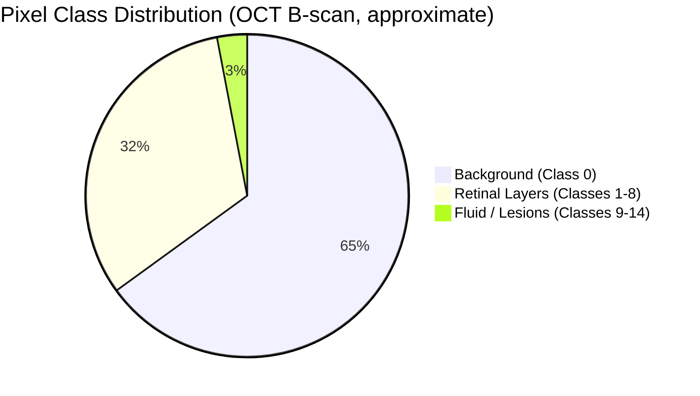
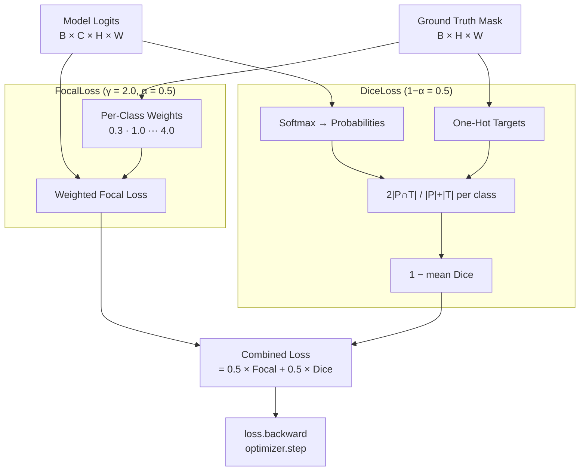
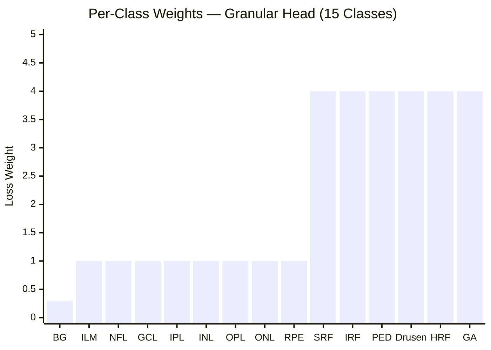
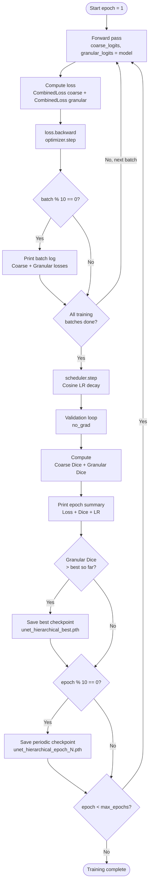

# Training Guide: Loss Functions, Class Weights & Metrics

This document covers the complete training setup for `HierarchicalUNet`, explaining *why* each design decision was made and how to tune it for your dataset.

---

## 1. The Problem with Vanilla CrossEntropyLoss

The naive starting point for any segmentation model is `nn.CrossEntropyLoss()`. For this dataset it is insufficient, for a specific reason:

**Extreme class imbalance.** In a typical OCT B-scan, the background class dominates at roughly 60–70% of all pixels. Fluid and lesion classes (Classes 9–14) may occupy less than 1% of pixels each. A model trained on vanilla CrossEntropy can achieve very low loss simply by predicting background everywhere — a model that predicts *all background* will score ~0.65 CE loss on a 512×512 scan and appear to be "training correctly" while producing near-zero Dice on the clinically important classes.

This is not a theoretical concern — it is the most common silent failure mode in medical segmentation training.

**Approximate pixel distribution in a typical OCT B-scan:**



The 3% sliver for fluid/lesions is exactly what the clinical diagnosis depends on. Vanilla CrossEntropy will happily ignore it.

---

## 2. The Combined Dice + Focal Loss

Both the coarse and granular heads are trained with `CombinedLoss`, defined in `training/train.py`.

### 2.1 DiceLoss

```python
Loss_Dice = 1 - mean_over_classes(
    (2 × |P ∩ T| + smooth) / (|P| + |T| + smooth)
)
```

Dice measures **overlap**, not per-pixel accuracy. It is inherently class-balanced: each class contributes equally to the mean regardless of its spatial frequency. A model cannot minimise Dice by predicting all-background.

### 2.2 Focal Loss with Class Weights

Standard CrossEntropy modified with per-class weights and a focusing parameter (γ=2.0) to heavily penalise hard, misclassified examples (like rare lesions):

```python
FocalLoss(p, t) = -Σ  weight[c] × (1 - p[c])^γ × log(p[c]) × 𝟙(t == c)
```

The weight for each class scales how much a misclassification is penalised. Rare classes get a high weight, the dominant background class gets a low weight.

### 2.3 Combined Formula

```
CombinedLoss(logits, targets) = 0.5 × FocalLoss + 0.5 × DiceLoss
```

The 50/50 split (`alpha=0.5`) is the standard starting point across the medical imaging literature (confirmed by RETOUCH and MICCAI 2024 benchmarks). Adjust `alpha` toward `1.0` if Dice loss causes instability in early training.

**How the combined loss is computed:**



---

## 3. Class Weights Reference

### Coarse Head (3 classes)

| Class | Label | Weight | Rationale |
|---|---|---|---|
| 0 | Background | **0.3** | Hugely dominant — down-weight aggressively |
| 1 | Structural Retina | 1.0 | Moderate frequency — neutral |
| 2 | Pathologies / Fluid | **4.0** | Rare and clinically critical — up-weight |

### Granular Head (15 classes)

| Class | Label | Weight | Rationale |
|---|---|---|---|
| 0 | Background | **0.3** | Same as coarse |
| 1–8 | Retinal Layers (ILM → RPE) | 1.0 | Well-represented in dataset |
| 9–14 | Fluid, Drusen, Lesions | **4.0** | Rare — clinically the most important to detect correctly |

> **These are starting-point estimates.** For a more principled approach, compute weights empirically from your actual dataset before a major training run. Run the following snippet once against your dataset:
>
> ```python
> from data.segmentation_dataset import OCT5kSegmentationDataset
> import torch
>
> ds = OCT5kSegmentationDataset(root_dir="/path/to/dataset")
> counts = torch.zeros(15)
> for _, _, mask_g in ds:
>     for c in range(15):
>         counts[c] += (mask_g == c).sum()
>
> # Inverse-frequency weights, normalised
> weights = 1.0 / (counts + 1)
> weights = weights / weights.sum() * 15
> print(weights)
> ```
> Replace the hard-coded tensors in `train.py` with these computed values.

**Granular head class weights at a glance:**



> The sharp jump between Class 8 (RPE) and Class 9 (SRF) reflects the boundary between well-represented retinal tissue and rare, clinically critical pathology.

---

## 4. Validation Metrics

The training loop tracks three metrics per epoch in the validation phase.

### 4.1 Validation Loss

```
Val Loss = CombinedLoss(coarse) + CombinedLoss(granular)
```

Useful for detecting overfitting (train loss falling while val loss rises), but **not** a direct measure of segmentation quality.

### 4.2 Dice Score (Primary Metric)

```python
Dice(pred, target) = 2|P ∩ T| / (|P| + |T|)
```

Computed per-class (excluding background class 0), then averaged. This is the primary benchmark for segmentation quality. Target benchmarks for this dataset:

| Head | Target Dice | Interpretation |
|---|---|---|
| Coarse (3-class) | > 0.80 | Good structural separation |
| Granular (15-class) | > 0.70 | Competitive layer and lesion segmentation |

> **The model is saved by best granular Dice, not by best val loss.** A checkpoint with lower loss but lower Dice is a worse model for clinical purposes.

### 4.3 Reading the Epoch Summary

```
--- Epoch 12/50 Summary ---
  Train Loss      : 0.4821
  Val Loss        : 0.5103
  Val Coarse Dice : 0.8340  (bg excluded; target > 0.80) ✓
  Val Granul Dice : 0.6891  (bg excluded; target > 0.70) — still improving
  LR              : 0.000087
```

- `Val Loss > Train Loss` by a small margin — normal generalisation gap.
- Coarse Dice above 0.80 — macroscopic anatomy is learned correctly.
- Granular Dice approaching target — granular classes still converging. Continue training.

---

## 4.4 Training Loop — Full Flow



---

## 5. Checkpointing Strategy

Two checkpoint types are saved to `checkpoints/`:

| File | Saved When | Use Case |
|---|---|---|
| `unet_hierarchical_best.pth` | New best granular Dice achieved | **Use this for inference** |
| `unet_hierarchical_epoch_N.pth` | Every 10 epochs | Recovery / resuming interrupted runs |

To resume training from a checkpoint:

```python
checkpoint = torch.load("checkpoints/unet_hierarchical_best.pth")
model.load_state_dict(checkpoint["model_state_dict"])
optimizer.load_state_dict(checkpoint["optimizer_state_dict"])
start_epoch = checkpoint["epoch"] + 1
```

---

## 6. Learning Rate Schedule

The training loop uses **Cosine Annealing** (`CosineAnnealingLR`):

```
LR(t) = η_min + 0.5 × (η_max - η_min) × (1 + cos(π × t / T_max))
```

- Starts at `1e-4`, decays smoothly to `1e-6` over 50 epochs.
- Avoids getting stuck in local minima late in training.
- No manual LR scheduling required.

---

## 7. Hyperparameter Tuning Guide

| Parameter | Default | Reduce if... | Increase if... |
|---|---|---|---|
| `batch_size` | 4 | GPU OOM errors | You have > 16 GB VRAM |
| `learning_rate` | 1e-4 | Loss diverges / NaN | Learning is very slow |
| `epochs` | 50 | Val Dice plateaus early | Model still improving at epoch 50 |
| `alpha` (loss) | 0.5 | Dice loss causes instability | CE dominates and imbalance persists |
| Lesion weights | 4.0 | Model over-predicts lesions everywhere | Lesion Dice remains near 0 |

---

## 8. Common Failure Modes

| Symptom | Likely Cause | Fix |
|---|---|---|
| Val Granular Dice ≈ 0.0 after 10 epochs | Class weights too low / wrong loss | Verify weights loaded onto correct device; confirm `CombinedLoss` is used |
| Loss is `NaN` from epoch 1 | Learning rate too high, or bad batch | Lower `learning_rate` to `5e-5`; check dataset for corrupt masks |
| Coarse Dice high but Granular Dice low | Hierarchical conditioning not working | Verify `softmax(coarse_logits)` is passed to granular head — not raw logits |
| Model predicts only background | Class imbalance not addressed | Confirm class weights are on the correct `device`; increase lesion weights to 6.0–8.0 |
