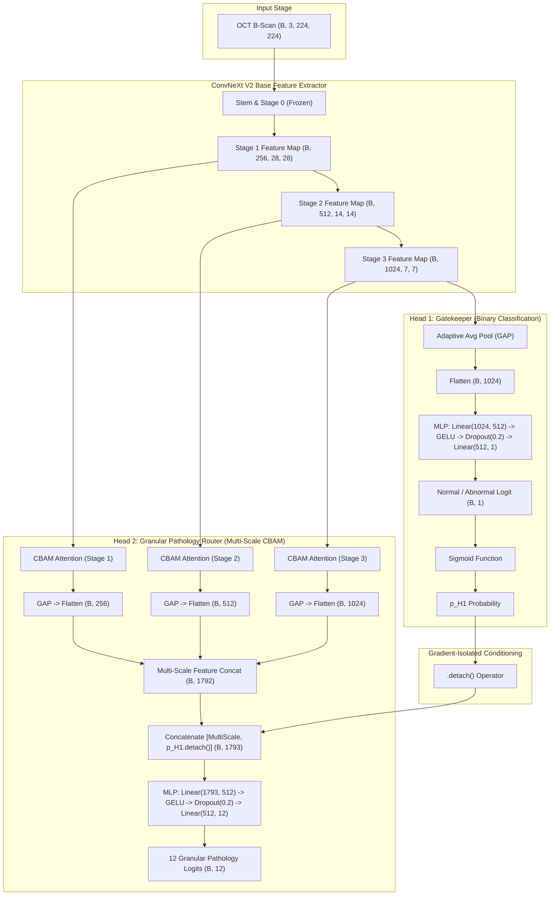
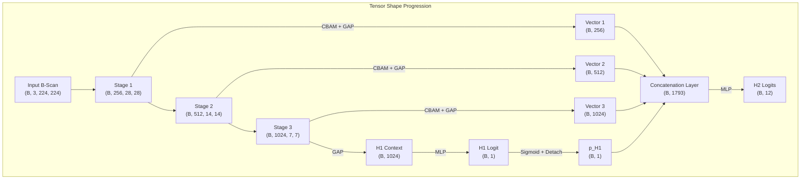
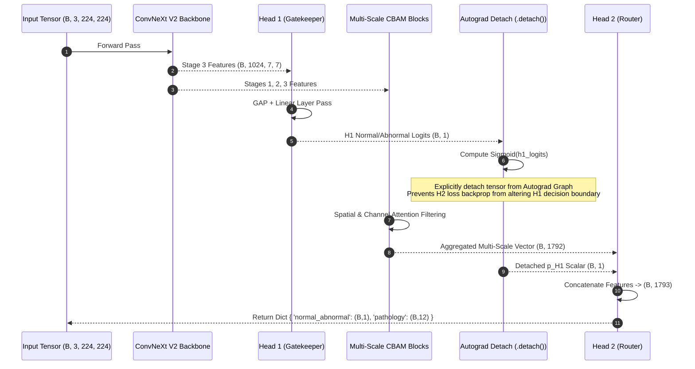

# Multi-Head ConvNeXt V2 System Architecture

This document specifies the architectural design of the unified multi-head classification network for OCT retinal scan analysis.

---

## 1. System Architecture Overview

The network utilizes a shared **ConvNeXt V2 Base** backbone operating on RGB-converted single-channel OCT B-scans (`224x224x3`). High-dimensional feature maps are extracted across multiple spatial depths and fed into dual processing streams:
1. **Head 1 (Gatekeeper)**: Binary classification for Normal vs Abnormal screening.
2. **Head 2 (Granular Pathology Router)**: Multi-scale attention-filtered pathology identification across 12 disease categories.

---

## 2. Layer Pipeline & Tensor Dimensionality

The multi-scale encoder aggregation extracts complementary spatial representations: fine-grained structural features from earlier layers (`Stage 1`) and deep semantic context from later layers (`Stage 3`).

---

## 3. Execution Sequence & Gradient Isolation

Hierarchical conditioning passes the predicted binary abnormal probability ($p_{H1}$) as a scalar feature to Head 2.

---

## 4. Architectural Rules & Constraints

### 4.1 Gradient Isolation Requirement
The $p_{H1}$ scalar concatenated into Head 2 must be explicitly detached via `.detach()`. Without `.detach()`, gradients from the multi-label focal loss on Head 2 would flow back through the binary probability and distort Head 1's decision boundary between healthy and pathological scans.

### 4.2 Multi-Scale Feature Pooling
Head 2 does not rely solely on the final bottleneck feature map. By pooling across Stage 1 (256 channels), Stage 2 (512 channels), and Stage 3 (1024 channels), the classification branch retains fine-grained spatial details (such as focal micro-drusen or small cystoid maculopathy) that are typically lost in deep bottleneck layers.

### 4.3 Strict Hierarchical Inference Rule
During evaluation and inference (`return_probs=True`), the joint pathology probability is explicitly conditioned on the binary health state:

$$P(\text{Pathology}_k) = P(\text{Pathology}_k \mid \text{Abnormal}) \times P(\text{Abnormal})$$

$$\mathbf{p}_{\text{final\_H2}} = \text{Softmax}(\mathbf{z}_{H2}) \times \text{Sigmoid}(z_{H1})$$

This mathematical conditioning guarantees zero probability leakage for granular pathologies when a scan is classified as healthy.
