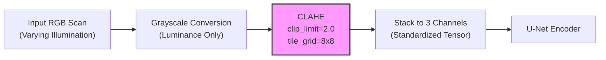

# Multi-Task OCT/OCTA Classification Architecture (Supersedes ConvNeXt V2)

> [!IMPORTANT]
> **Architecture Migration Notice (July 2026)**
> The standalone classification model (ConvNeXt V2 Base) has been officially superseded. The classification pipeline is now fully integrated into the **Multi-Task Learning (MTL) Hierarchical U-Net**. This "Best of Both Worlds" network shares a single convolutional encoder for both pixel-perfect semantic segmentation and holistic disease classification.
> *Note: The legacy standalone ConvNeXt model did NOT implement strict hierarchical conditioning (its heads operated independently). The strict hierarchical conditioning cascade described below was introduced exclusively in the unified U-Net.*

Instead of maintaining a complex, standalone classification model, we unified the entire pipeline into a **single, powerful backbone** that extracts a shared global feature vector. This bottleneck feeds into three independent, specialized classification prediction heads, tightly coupled with strict hierarchical conditioning to prevent contradictory predictions.

---

## 1. The Global Data Flow

Here is the visual representation of how a single input scan flows through our unified MTL classification pipeline during inference:

```mermaid
graph TD
    Input(Input Image Scan) --> Backbone

    subgraph Backbone ["Shared Encoder (U-Net)"]
        Encoder[Encoder Stages x3, x4, x5<br/>256ch, 512ch, 1024ch]
    end

    Backbone --> Pool[Multi-Scale Aggregation<br/>Concat + Linear Proj -> 1024-d]
    
    Pool --> H1
    Pool --> H2
    Pool --> H3

    subgraph Heads ["Hierarchical Cascaded Prediction Heads"]
        H1{L1: Normal vs Abnormal<br/>Binary Logit}
        H2{L2: Pathology Routing<br/>5 Broad Categories}
        H3{L3: Severity/Biomarkers<br/>5 Multi-Label Specialists<br/>(11 Total Classes)}
    end

    H1 -.->|L1 Probabilities| H2
    H1 -.->|L1 Probabilities| H3
    H2 -.->|L2 Probabilities| H3

    H1 -->|Sigmoid > 0.5| OutNormal([Abnormal])
    H2 -->|Softmax| OutPath([Macular / Diabetic / Vascular / Fluid / Structural])
    H3 -->|Sigmoid| OutBio([CNV, DRUSEN, Generic_AMD, DME, DR, MH, RVO, RAO, CSR, ERM, VID])
```

---

## 2. Layer-by-Layer Breakdown

### The Backbone (Shared Feature Extractor)
- **Model:** `HierarchicalUNet` Encoder.
- **Role:** The model extracts multi-scale features from the x3 (256-channel), x4 (512-channel), and x5 (1024-channel) encoder stages. These stages are independently average-pooled, concatenated (1792 channels total), and projected via a learned linear layer and GELU activation into a rich 1024-dimensional global feature vector.
- **Input Resolution:** `512 x 512` pixels (standardized across the MTL pipeline).

### L1: Binary Triage (Normal vs Abnormal)
- **Role:** Safely screens out healthy patients. 
- **Input:** 1024-channel aggregated feature vector.
- **Output:** 1 Logit (Binary).
- **Activation/Loss:** `Sigmoid` / `BCEWithLogitsLoss`.

### L2: Disease Router (Pathology Families)
- **Role:** Categorizes abnormal scans into one of five broad disease families.
- **Strict Conditioning:** To prevent contradictory predictions, this head receives the 1024-channel aggregated features **concatenated with the L1 output probability** (1025 channels).
- **Output:** 5 Logits.
- **Classes:** `Macular_Degeneration`, `Diabetic_Complications`, `Vascular_Occlusions`, `Structural_Issues`, `Fluid_Accumulation`.
- **Activation/Loss:** `Softmax` / `FocalLoss`.

### L3: Granular Biomarkers (Multi-Label Specialists)
- **Role:** Detects highly specific biomarkers for multi-morbidity detection.
- **Strict Conditioning:** To enforce the global hierarchy, this head receives the 1024-channel aggregated features **concatenated with both the L1 and L2 output probabilities** (1030 channels).
- **Output:** 11 Logits.
- **Classes:** `CNV`, `DRUSEN`, `Generic_AMD`, `DME`, `DR`, `MH`, `RVO`, `RAO`, `CSR`, `ERM`, `VID`.
- **Activation/Loss:** `Sigmoid` / `BCEWithLogitsLoss`.

---

## 3. Preprocessing: CLAHE Scanner Normalization

Before any augmentation or model inference, every image passes through **CLAHE (Contrast Limited Adaptive Histogram Equalization)**. This is a **deterministic** preprocessing step applied identically at train, validation, and test time — it is NOT an augmentation.

**The Problem:** OCT scanners from different manufacturers (Zeiss, Heidelberg, Topcon) produce images with wildly different brightness and contrast profiles. Without normalization, the model learns scanner-specific intensity distributions instead of pathology — a form of shortcut learning that causes the model to fail on any unseen device.

**The Solution:**
- Convert RGB scan to grayscale (OCT diagnostic information is luminance-based; color is redundant).
- Apply CLAHE with `clip_limit=2.0` and `tile_grid=(8, 8)` to equalize local contrast adaptively.
- Stack back to 3-channel RGB (required for pre-trained backbone compatibility).

**Preprocessing Pipeline Flow:**



---

## 4. Training Strategy: Interleaved Multi-Task Learning

The classification and segmentation tasks are trained jointly in a single 35-hour pass. To ensure the encoder isn't torn apart by massive segmentation gradients early in training (which would destroy the classification feature space):

1. **Dynamic Loss Weighting (Warm-Up)**: The combined objective is $L_{total} = L_{class} + (\lambda \cdot L_{seg})$. We initialize $\lambda = 0.01$ and use a linear scheduler to ramp it to $1.0$ over the first 15 epochs.
2. **Classification Focus**: This allows the encoder to establish a stable, generalized diagnostic foundation before hyper-precise segmentation boundaries demand heavy parameter updates.

*This documentation reflects the pipeline configuration as of July 2026. The legacy multi-model hierarchy and standalone ConvNeXt V2 were superseded by the unified Multi-Task Hierarchical U-Net architecture.*
