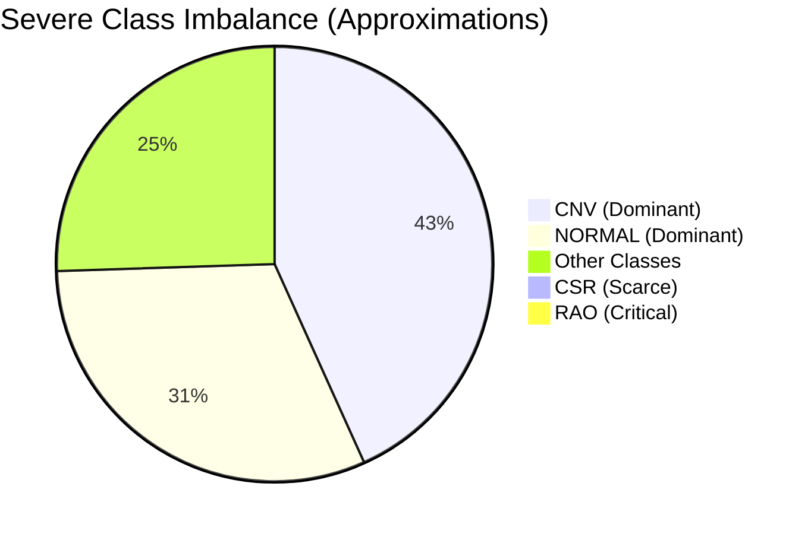
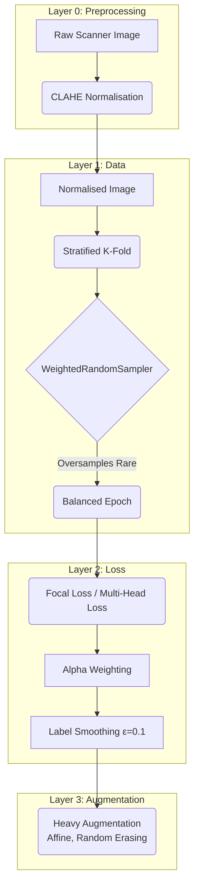

# OCT Pipeline — Data & Imbalance Strategy

## Dataset Composition

The pipeline aggregates data from three disparate sources to form a master dataset of **86,120 OCT/OCTA scans**:
1. Kermany/UCSD dataset
2. OCTDL dataset
3. OCTID dataset

> [!NOTE]
> For complete citations, descriptions, and the specific training/testing split strategy regarding these sources, please refer to the [Dataset Documentation](dataset.md).

This multi-source approach increases generalisation but introduces significant variations in labelling schemas and class distributions. `config/hierarchy.yaml` serves as the single source of truth, mapping raw directory paths to standardized tuples for our multi-head network: `(label_h1, label_h2, label_h3)`.

## The Imbalance Problem

In the medical imaging domain, rare diseases mean scarce data. The class distribution across all fine classes highlights a critical long-tail imbalance:



> [!CAUTION]
> **The Threat of Collapse**
> Training a standard model on this distribution results in the network collapsing: it learns to constantly predict "CNV" and achieves high accuracy by completely ignoring the rare pathologies (like RAO).

## Three-Tiered Imbalance Mitigation

To force the network to learn the rare classes simultaneously across all three heads, we implement a defensive stack across three layers: the DataLoader, the Loss Function, and the Augmentation Pipeline.

## Scanner Normalisation — CLAHE Preprocessing

Before any augmentation or model input, every image passes through **Contrast Limited Adaptive Histogram Equalisation (CLAHE)**. This is a deterministic, non-stochastic preprocessing step — not an augmentation — applied identically at train, val, and test time.

> [!IMPORTANT]
> **Why CLAHE?**
> This dataset aggregates scans from at least three different OCT scanner families (Zeiss Cirrus, Heidelberg Spectralis, Topcon devices). Different scanners produce systematically different base brightness and local contrast levels. Without normalisation, the model may learn scanner-specific intensity distributions as a shortcut rather than pathology — a form of domain leakage that degrades performance when evaluated on scans from an unseen device.

```
clip_limit = 2.0      # Prevents noise amplification in homogeneous regions
tile_grid  = (8, 8)   # Adaptive tiles: independent equalisation per region
```

The output is converted to 3-channel greyscale-stacked RGB, which is required for the ImageNet-pretrained ConvNeXt V2 backbone.

## Three-Tiered Imbalance Mitigation Architecture



### 1. Stratified K-Fold + WeightedRandomSampler (Data Layer)
- **Stratified K-Fold:** We use `sklearn.model_selection.StratifiedKFold(n_splits=5)`. This ensures that even the rarest classes (like the 22 RAO images) are proportionally distributed across all 5 folds. Without stratification, a fold might contain zero RAO images, crashing the AUROC metric.
- **WeightedRandomSampler:** In the training dataloader, we calculate the inverse frequency of each class (`1.0 / count`). We feed these weights to PyTorch's `WeightedRandomSampler`. This changes the sampling probability so that the dataloader oversamples minority classes and undersamples dominant classes, ensuring that *within any given epoch*, the model sees a balanced number of examples from every class.

### 2. Multi-Head Loss + Alpha Weighting (Loss Layer)
Even with balanced sampling, "easy" examples (like classic NORMAL scans) can overwhelm the gradient flow compared to "hard" border-case examples.

- **Dynamic `pos_weight` Scaling:** We pass the calculated ratio of negative-to-positive samples as a `pos_weight` variable directly into PyTorch's `BCEWithLogitsLoss`. This ensures the mathematical penalty (the gradient) for missing a rare disease is artificially magnified to match the volume of the dominant diseases.
- **Label Smoothing (ε=0.1):** Applied to the categorical Head 2. Because our dataset is essentially a "mashup" of three different clinical datasets annotated by different doctors, there is inherent "label noise" (e.g. one doctor might label a scan "AMD" while another calls the exact same scan "DRUSEN"). Label smoothing mathematically prevents the model from becoming 100% confident in its predictions, making it more robust to these human inconsistencies.

### 3. Targeted Augmentation (Defending Against Machine Variance)
Because we aggregate data from multiple hardware vendors (Zeiss Cirrus, Heidelberg Spectralis, Topcon), our dataset suffers from **Machine-Specific Variance**. Different machines use different laser wavelengths, resulting in distinctly different noise profiles, resolutions, and contrast levels. 

If we don't protect against this, a Deep Learning model will "cheat." Instead of learning what a disease looks like, it will memorize the noise profile of the specific machine that captured the disease. To force the model to learn true clinical biology, we apply a heavily constrained visual distortion pipeline (`train_transform`):

- **UI Artifact Defense (`BlackoutCorners`)**: OCT machines often imprint compasses, manufacturer logos, or measurement scales into the corners of the raw image file. If left unchecked, the model will suffer from "Clever Hans" effect—memorizing the UI of the machine that captured the diseased class, rather than the disease itself. We explicitly zero out the bottom 18% of the raw frame to mask these artifacts *before* any resizing occurs.
- **Warping Defense (`LetterboxPad`)**: Medical images have highly variable aspect ratios (e.g., wide 1024x512 scans vs square 512x512 scans). Using standard resizing or random cropping introduces catastrophic tissue loss or severe horizontal squishing, completely distorting the shape of critical biomarkers like fluid pockets. We use letterboxing to pad the shortest edge with pure black pixels until the image is a perfect square, preserving 100% of the biological aspect ratio before resizing to the 224x224 ConvNeXt input tensor.
- **`RandomAffine(degrees=10, translate=(0.05, 0.05))`**: Simulates minor patient head-tilt and natural saccadic eye movement during the scan, forcing the network to recognize the retina regardless of its angle.
- **`ColorJitter(brightness=0.15, contrast=0.15)`**: Intentionally alters the brightness and contrast of the scan. This directly combats machine variance by preventing the model from memorizing the specific contrast signature of a Zeiss or Heidelberg scanner. We keep the jitter mild so we don't accidentally wash out low-contrast structural anomalies (like Drusen or Epiretinal Membranes).
- **`GaussianBlur(kernel_size=3)`**: Occurs ~20% of the time. This mathematically blurs the image just enough to smooth out the high-frequency scanner noise (the grainy "speckle" artifacts), forcing the model to rely on the actual physical geometry of the retina.

> [!CAUTION]
> **Random Erasing, Mixup & CutMix: Proceed with extreme caution (Disabled).** 
> While these are standard tools for normal images (like classifying dogs vs. cats), they are highly destructive in medical imaging. `RandomErasing` (blacking out random boxes) can literally delete a single small fluid pocket, erasing the disease entirely. `CutMix` might paste a Macular Hole into a scan of Diabetic Macular Edema, creating an anatomically impossible "frankenstein" retina that severely confuses the model's spatial understanding of human biology.

By combining deterministic CLAHE normalisation, dynamic `pos_weight` loss functions, balanced dataloader sampling, and constrained, artifact-breaking augmentations, we maximise the predictive signal extracted from the rare diseases while remaining completely blind to the specific brand of machine that captured them.
