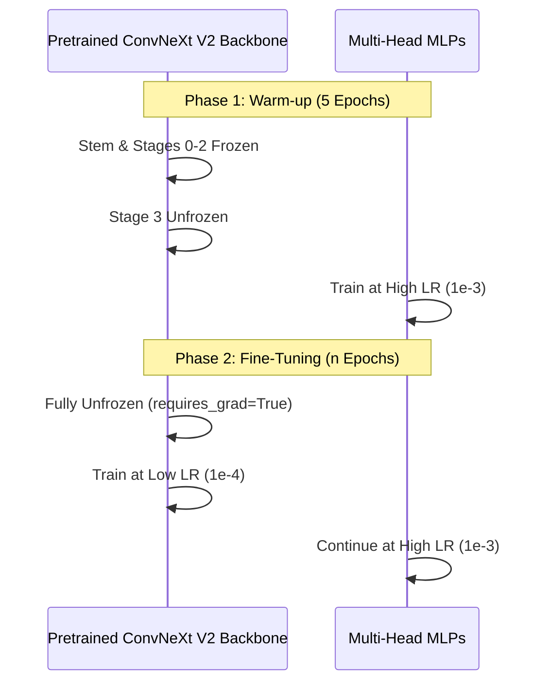

# OCT Pipeline — Training Engine & Optimisations

> [!IMPORTANT]
> **Architecture Migration Notice (July 2026)**
> The standalone classification model (ConvNeXt V2 Base) and its training pipeline documented here have been officially superseded. The classification pipeline is now fully integrated into the **Multi-Task Learning (MTL) Hierarchical U-Net**. This legacy documentation is retained for historical context on the imbalance mitigation strategies.
## Unified Multi-Head Training

Since migrating to the `MultiHeadConvNeXtV2` architecture, the training loop no longer trains separate models for different hierarchy levels. Instead, it trains a single model with three distinct classification heads using a combined loss function.

### Two-Phase Training Protocol

Transfer learning from ImageNet features to grayscale medical OCT scans requires care. If we immediately train the entire network, the large gradients flowing backward from the randomly initialized classifier heads will permanently destroy the useful pretrained convolutional features.



**Phase 1: Warm-up (Head & Final Stage Only)**
- The convolutional backbone's stem and early stages (0-2) are `frozen` (requires_grad = False).
- We train only the final stage (Stage 3) and the classifier heads for the initial epochs using a relatively high learning rate (`1e-3`).
- This allows the randomly initialized heads to "warm up" and orient themselves to the OCT feature space without disrupting the low-level backbone features.

**Phase 2: Fine-Tuning (Full Network)**
- The entire backbone is `unfrozen`.
- We use **differential learning rates**: the classifier heads continue at `1e-3`, but the unfrozen backbone is trained at a much lower rate (`1e-4`).
- This allows the deep convolutional layers to slowly adapt to the unique textures of retinal pathology, while the heads continue to converge rapidly.

### Multi-Head Combined Loss

The network predicts three outputs simultaneously. The total loss is a weighted sum of three independent loss functions:
1. **Head 1 (Binary Normal/Abnormal):** `BCEWithLogitsLoss`
2. **Head 2 (Pathology Routing - 5 Classes):** `CrossEntropyLoss`
3. **Head 3 (Biomarkers - 11 Multi-Label Classes):** `BCEWithLogitsLoss`

$$ \text{Total Loss} = \lambda_1 \text{Loss}_{H1} + \lambda_2 \text{Loss}_{H2} + \lambda_3 \text{Loss}_{H3} $$

### Learning Rate Scheduling & Early Stopping

- **CosineAnnealingWarmRestarts:** During Phase 2, we use a cosine annealing schedule with warm restarts.
- **Early Stopping:** Monitored on the validation loss. If validation loss does not improve for consecutive epochs, training halts.
- **Gradient Clipping:** `max_norm=1.0` is applied before every optimizer step. Focal Loss or combined multi-head losses on heavily imbalanced micro-batches can produce exploding gradients; clipping guarantees stability.

## Hardware Optimizations (Apple Silicon / MPS)

The training pipeline is aggressively tuned for local Apple Silicon (M2/M3) environments using the Metal Performance Shaders (MPS) backend. Because PyTorch on Apple Silicon is relatively new, we have to implement several advanced protections:

### 1. MPS Memory & Bug Patching
- **`PYTORCH_ENABLE_MPS_FALLBACK=1`**: PyTorch on Mac doesn't yet support every single mathematical tensor operation natively on the GPU. If a model tries to run an unsupported operation, it will silently crash. This environment variable forces PyTorch to safely "fall back" and route those specific unsupported operations to the CPU instead of crashing the entire pipeline.
- **`timm` Segfault Patch**: `timm` (PyTorch Image Models) uses a C-level operation called `trunc_normal_` to mathematically initialize the weights of the newly created classification heads. Unfortunately, on M2 chips, this specific operation triggers a Fatal Python error called a Segmentation Fault (Killed: 9), instantly terminating the program. To fix this, we intercept and "monkeypatch" (replace on-the-fly) this function with standard `torch.nn.init.normal_` at the very top of our script.
- **Garbage Collection (`torch.mps.empty_cache()`)**: Mac chips use Unified Memory (sharing RAM between the CPU and GPU). During the transition between training epochs and validation loops, PyTorch can sometimes fail to release memory fast enough, causing unified memory fragmentation and eventually an Out-Of-Memory (OOM) crash. We explicitly force PyTorch to clear the GPU cache after every validation loop to keep memory usage stable.

### 2. Mixed Precision (AMP `float16`)
- Deep Learning models normally calculate numbers to 32 decimal places (`float32`). The trainer employs `torch.autocast(device_type="mps", dtype=torch.float16)` to reduce this to 16 decimal places (`float16`) during the forward pass.
- **Memory impact**: This cuts the memory footprint of our activations exactly in half, which is the reason we are able to push the batch size (the number of images processed at once) up to 64 without exceeding the Mac's memory limits.

### 3. DataLoader Threading
- `num_workers=0` is strictly enforced. Normally, you want multiple CPU threads (workers) fetching images from the hard drive while the GPU trains. However, on macOS, utilizing multiple background threads to load data into an MPS-bound model often triggers threading deadlocks (`pthread_mutex` lockups) or `libomp` crashes. Forcing `0` means the main process handles the loading, ensuring absolute stability at a minor cost to speed.

---

## The Imbalance Mitigation Engine

Medical datasets are notoriously imbalanced. In this dataset, there are roughly 37,205 images of CNV (a common disease) versus only 22 images of RAO (a very rare disease). If we train a model naively on this data, it will suffer from "network collapse": the model will realize it can achieve 99% accuracy simply by guessing "CNV" every single time, completely ignoring the rare diseases. 

To force the network to care about the rare diseases, we implement a mathematical **defense mechanism** directly in the loss functions:

### A. Dynamic Positive Weighting (`pos_weight`)
Instead of using generic loss functions, our pipeline intercepts the `dataset_manifest.csv` via the Pandas library and mathematically calculates the exact ratio of negative to positive samples for every single clinical label.

- **Head 3 (Multi-Label Diagnostics)**: This head predicts the presence of 11 distinct biomarkers. It uses a dictionary of five independent `BCEWithLogitsLoss` (Binary Cross Entropy) functions. This specific loss function allows the model to predict multiple co-occurring diseases (e.g., a patient having both AMD and Diabetic Edema) rather than forcing it to pick just one. The script dynamically calculates `pos_weight = (Total Negatives) / (Total Positives)` for each sub-disease. For a rare disease like RAO, this value is huge (~4,000), scaling the gradient proportionally.

### B. The "0 False Negatives" Triage Net (Head 1)
In clinical deployment, a false negative (sending a diseased patient home) is infinitely worse than a false positive (flagging a healthy patient for review). To mathematically enforce a **0 False Negatives** policy, we transformed Head 1 (Binary Normal vs. Abnormal) into a highly sensitive Triage Net.
- **The False Negative Multiplier**: We inject a hardcoded `2.0x` multiplier directly into Head 1's `pos_weight` calculation. If the network misses an abnormal scan (a false negative), it is penalized mathematically twice as hard as it normally would be. 
- **The Trade-Off**: The model will learn that it is far safer to throw a False Positive (guessing a disease might be there when it's just noise) than to ever risk a False Negative. This sacrifices some precision to guarantee maximum sensitivity (Recall), acting as a perfect safety net before human review.

### C. Head Gradient Balancing
Because Head 3 calculates 5 independent BCE losses at the same time, simply adding them together results in a total gradient (the mathematical signal telling the model how to adjust its weights) that is 5x larger than Head 1. 

If we don't fix this, Head 3 will completely overpower the shared backbone, ignoring the other heads. To prevent this, we scale its `loss_weight` down to `0.5` (adjusted up from `0.2` to provide stronger granular supervision while maintaining balance).

```python
loss_weights = {
    'h1': 1.0,
    'h2': 2.0,  # Up-weighted to focus the network on the difficult primary routing task
    'h3': 0.5   # Scaled to balance the 5 accumulated BCE sub-losses
}
```

### D. Conditional Masked Loss & Focal Scaling
In our dataset aggregation, detailed biomarker labels (Head 3) were only provided for specific subsets of the data. For instance, `Fluid_Accumulation` pathologies might be labeled with sub-biomarkers like `CSR`, but scans labeled as `Structural_Issues` lack these granular labels entirely (they effectively act as false negatives for CSR).

If we allow the network to calculate Head 3 loss on *all* images across all families, the gradients aggressively penalize the network for failing to predict biomarkers on images that simply lack those labels. This causes the gradients for Head 3 to collapse, driving all biomarker confidences permanently to 0%.

### 3. Focal Loss & Dynamic Gradient Scaling
Because medical datasets have extreme data scarcity for specific sub-diseases (e.g., 30,000 CNV scans vs. only 60 VID scans), standard Cross-Entropy Loss fails to learn the rare classes.
* **The Solution:** We implement Custom **Focal Loss** modules (`BinaryFocalLossWithLogits` and `MultiClassFocalLoss`).
* **Mechanism:** Focal Loss dynamically scales down the gradients for "easy" predictions (like the massively overrepresented CNV) and mathematically forces 100% of the network's learning capacity onto the rare classes (VID, CSR) using a focusing parameter ($\gamma = 2.0$).
* **Class Weighting:** We integrate dynamic positive weighting ($\alpha$) inversely proportional to the class frequency. This is clamped to a minimum of `1.0` to prevent catastrophic zero-gradient collapse for single-member subfamilies (e.g., Fluid Accumulation).

To solve this, we implemented **Boolean Loss Masking**:
During the forward pass in `MultiHeadTrainer._compute_loss`, we use the *ground-truth* Head 2 label (the Pathology Family) to generate a boolean mask. We explicitly zero out the Head 3 loss for any biomarker that does *not* belong to the current image's Head 2 family. This guarantees that Head 3 only receives gradient updates from images that actually contain valid, high-resolution biomarker labels, perfectly preserving the gradient flow.

### C. Optimizer Profile
ConvNeXt architectures are highly sensitive and require heavy regularization to prevent overfitting. We use the `AdamW` optimizer with a high `weight_decay=0.05` (which mathematically penalizes weights from growing too large). We pair this with a `CosineAnnealingWarmRestarts` learning rate scheduler, which smoothly drops the learning rate following a cosine curve, allowing the model to gently settle into the most optimal solution.

---

## Training Incidents & Learnings

### Incident 1: Systemic Mode Collapse on Highly Imbalanced Data
During the initial multi-head training run, the model suffered from **Systemic Mode Collapse** across every single head:
- **Head 1 (Triage Net)** predicted `Abnormal` 100% of the time.
- **Head 2 (Pathology Router)** predicted `CNV` (the majority class) 100% of the time, completely ignoring the dynamic loss weights.
- **Head 3 (Biomarkers)** flatlined into outputting `Negative` for every prediction.

#### Root Cause Analysis
The collapse was triggered by a fatal combination of hyperparameter defaults interacting with our dynamic class weighting:
1. **Aggressive Warm-up Learning Rate (`1e-3`)**: When combined with extreme loss weights (e.g. 2.0x for Head 1 False Negatives), a massive learning rate caused the randomly initialized heads to instantly panic during the very first few optimization steps. The optimizer took the path of least mathematical resistance: slamming all predictions to the heavily-weighted majority classes so it would never get penalized for a False Negative again.
2. **Strict Gradient Clipping (`max_norm=1.0`)**: We used dynamic class weights to scale up the gradients of ultra-rare diseases (like RAO) by over 600x. However, the strict `max_norm=1.0` gradient clipper was brutally neutralizing these massive corrective spikes before they could update the weights. Our loss weights were effectively being deleted by the clipper.

#### The Patch
To break the model out of the local minimum and allow it to learn the nuances of the rare diseases, the following hyperparameter patches were implemented:
- **Reduced Warm-up Learning Rate** down to `1e-4` and **Fine-tuning** down to `1e-5` to enforce slow, deliberate feature extraction over panic-guessing.
- **Increased Gradient Clipping** threshold up to `max_norm=5.0` to allow the extreme `600x` loss weights from the rarest diseases to actually penetrate the backbone and update the network.
